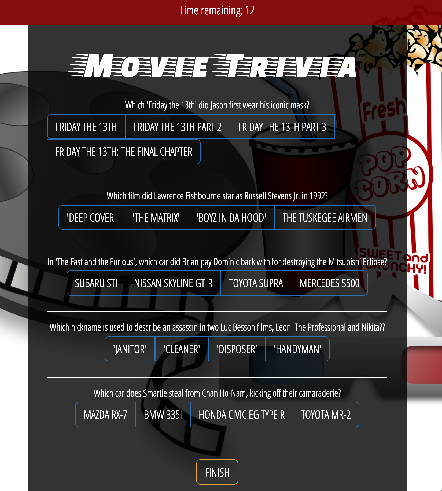
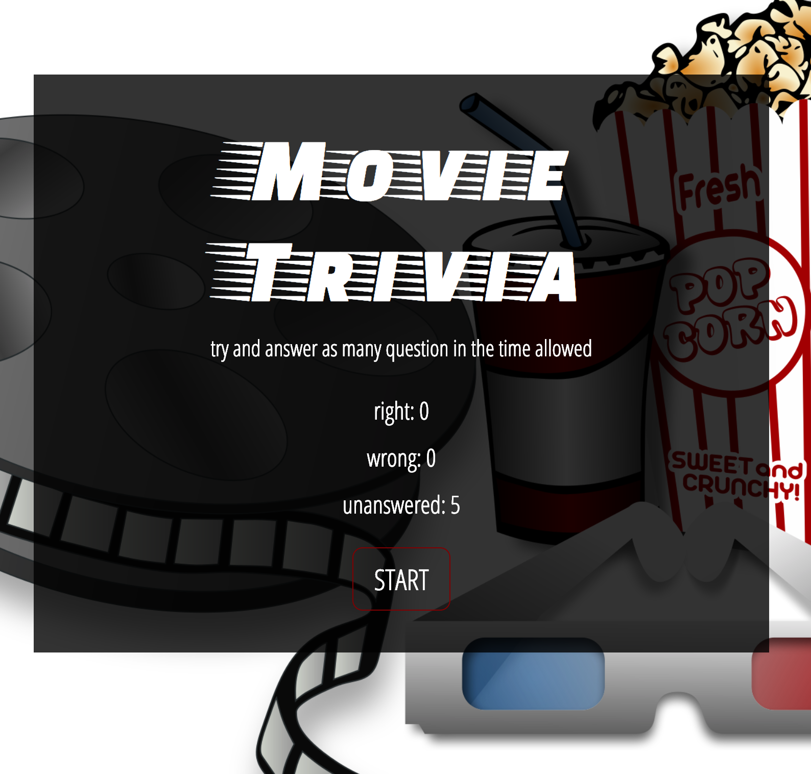
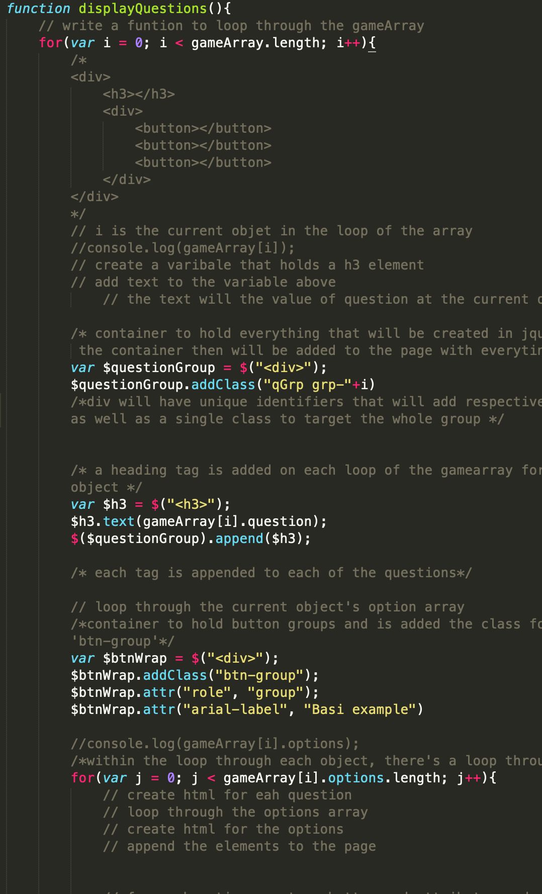
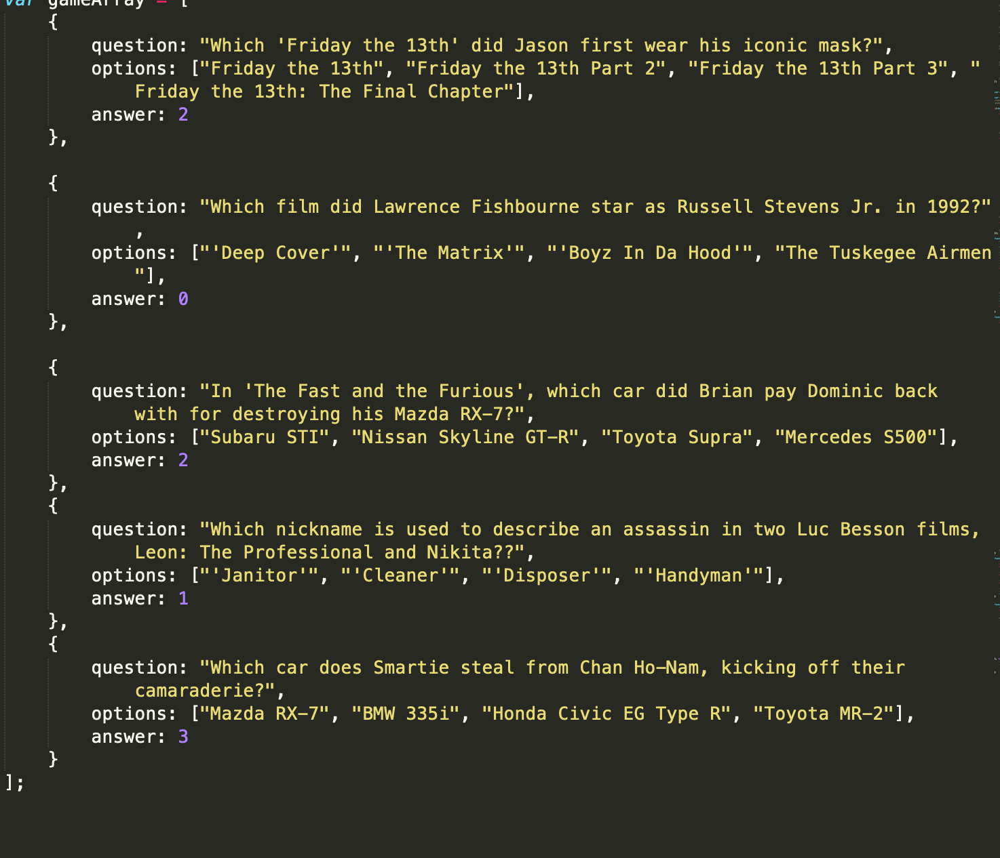
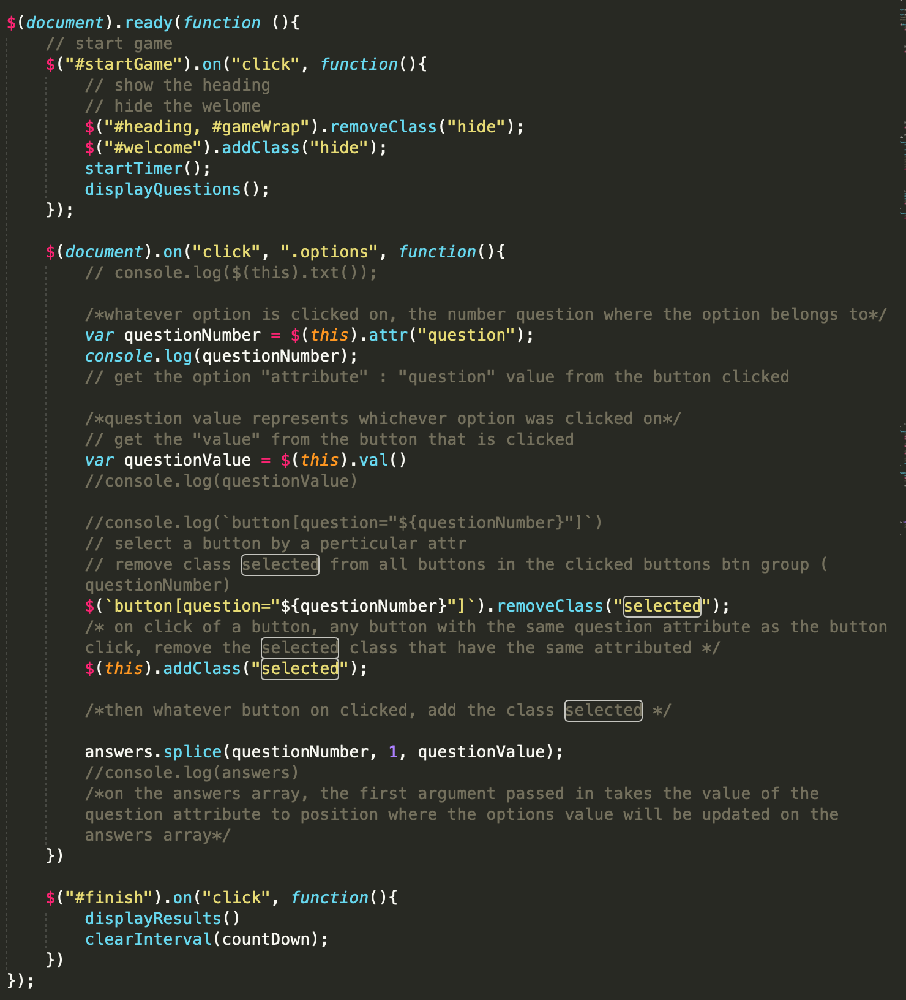
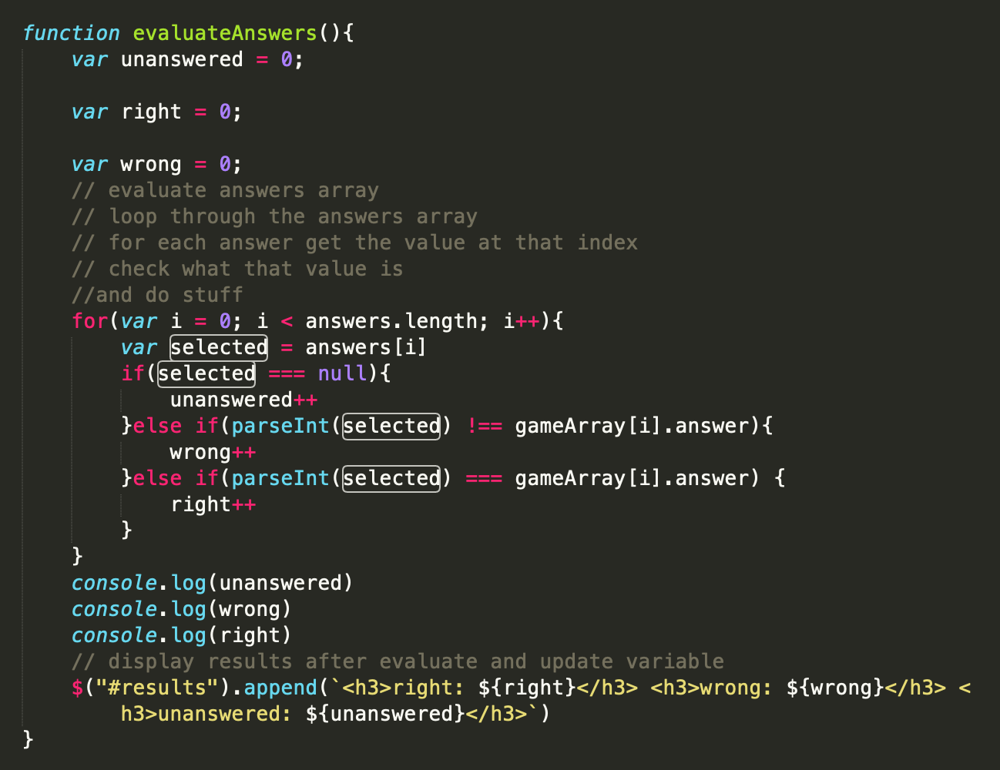
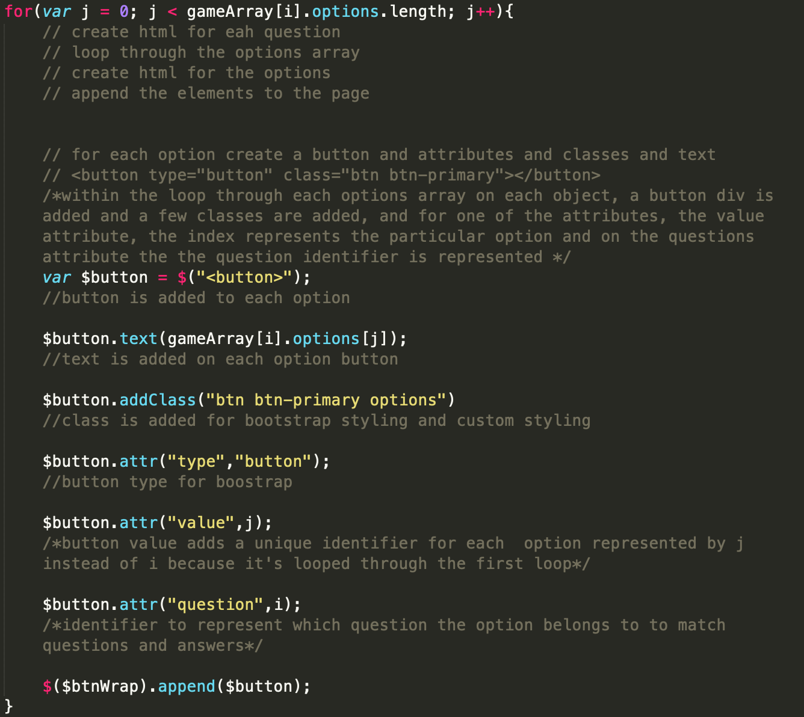
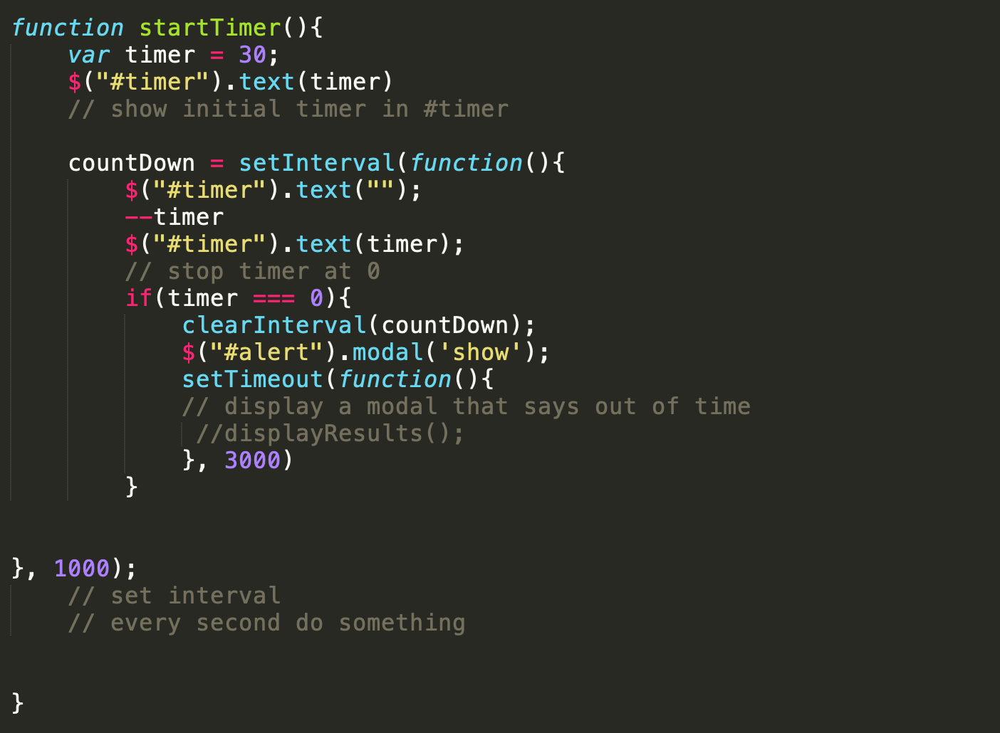

# TriviaGame

TrivaGame is an app game that allows users to click buttons to guess the correct answers to questions within a given allotment of time, ending when the user submits all of their answers to the questions.

## **Libraries** 

**jQuery, Bootstrap**

## **Installation** 

**jQuery library CDN:**

``

**Bootstrap JS CDN:**
``

**Bootstrap CSS CDN:**

`<link rel="stylesheet" href="https://maxcdn.bootstrapcdn.com/bootstrap/3.3.7/css/bootstrap.min.css" integrity="sha384-BVYiiSIFeK1dGmJRAkycuHAHRg32OmUcww7on3RYdg4Va+PmSTsz/K68vbdEjh4u" crossorigin="anonymous">`

The bulk of the app’s content sits within a container where static buttons exist. First a ‘Start’ button to display a 30 second countdown timer on top and trigger the appearance of hidden answer input buttons to displayed questions. The second button, ‘Finish’ is there for submitting the input values and triggering the display of results of the users’ input answers compared to the actual answers of the quiz. It also kicks in the appearance of the ‘Start’ button to replay the quiz. When time runs out to 0 before the ‘Finish’ button is input, a modal fades in with a curtain message ‘out of time!’. Although, time stops at 0, users can still input answers.

HTML elements are laid on top of bootstrap grid columns with sizes and positions adjusted by CSS. 

jQuery selector methods populate the container with button classes and  provide hooks to sort which buttons are input when a user clicks a button to answer a question.

JavaScript provides logic for determining the score based on which button input values where chosen and how the timer counts down.

 

 

 
